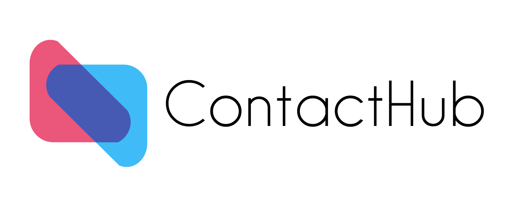

# ContactHub 

> ⚠️ ContactHub is currently in development and is not yet ready for use. Please
> check back soon for updates!

ContactHub is a decentralized ActivityPub service that allows you to securely
share your contact information with e-commerce platforms like Amazon and
Shopify, as well as your family and friends. By leveraging the power of
decentralization, ContactHub puts you in control of your personal information,
ensuring privacy and security.

**Docs:** [docs.contacthub.dev](https://docs.contacthub.dev)

## Features

- Decentralized contact information management
- Secure and encrypted data sharing
- Integration with popular e-commerce platforms like Amazon and Shopify
- User-friendly interface for managing your contacts
- Customizable privacy settings
- Access control for sharing your contact information with specific individuals
  or groups

## Getting Started

To start using ContactHub, please follow the instructions in our
[documentation](https://docs.contacthub.dev/).

## How it works

ContactHub uses the [ActivityPub](https://www.w3.org/TR/activitypub/) protocol
for decentralized communication. Your contact information is stored securely on
your own server or a server of your choosing, and is only shared with the
parties you explicitly authorize. This ensures that your personal information is
kept private and secure at all times.

## Contributing

We welcome contributions to ContactHub! Please read our
[contribution guidelines](https://docs.contacthub.dev/contributing) for
information on how to get involved.

## Support

If you encounter any issues or have questions about ContactHub, please visit our
[documentation](https://docs.contacthub.dev) for troubleshooting tips and
guides. If you still need assistance, feel free to reach out through our
[community forum](https://community.contacthub.dev) or
[submit a support request](https://docs.contacthub.dev/support).

## License

ContactHub is released under the GNU Affero General Public License v3.0. This is
the same license used by
[Mastodon](https://github.com/mastodon/mastodon/blob/64fae0efb5348a792311c4f749fc852f0e3d38c9/LICENSE).

## Connect with us

Stay up to date with the latest news and updates by following ContactHub on
social media:

- _Soon_

We look forward to connecting with you!
